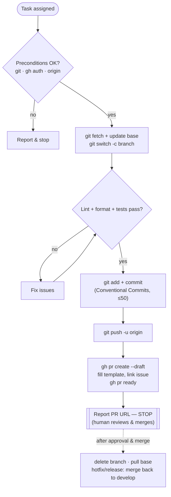

# Gitflow Workflow

Take a change from a fresh branch to an open pull request, following the organization's
gitflow and commit conventions.

**You never merge your own PR.** Per
[`git-code-review`](../../references/git/git-code-review.md), a change needs at least one
approval and self-merge is not permitted. End at "PR ready for review"; a human approves
and merges. This matters because review is the quality gate the whole policy is built on —
skipping it defeats the point.

## Preconditions

Verify before starting; stop and report if any fails:

- `git --version` and `gh --version` succeed.
- `gh auth status` shows an authenticated account.
- A remote named `origin` exists (`git remote get-url origin`).
- You are **not** about to commit on a protected branch (`main`, `develop`).
- The working tree state is understood (`git status`); stash unrelated changes if needed.

## Choose the flow

| Flow | Branch | Origin (fork from) | PR base | Merge-back | Tag |
| --- | --- | --- | --- | --- | --- |
| Feature | `feature/<issue_id>-<name>` | `develop` | `develop` | — | — |
| Hotfix | `hotfix/<issue_id>-<name>` | `main` | `main` | also into `develop` | `v<version>` on `main` |
| Release | `release/<version>` | `develop` | `main` | also into `develop` | `v<version>` on `main` |

Branch names follow [`branch-name-helper`](../../prompts/git/branch-name-helper.md).

## Stage 1 — Start development

```bash
git fetch origin
# base = develop for feature/release, main for hotfix
git switch develop
git pull --ff-only origin develop
# create and check out the working branch from the up-to-date base
git switch -c feature/EG-123-short-description develop
```

For hotfix, swap `develop` → `main`. For release, name the branch `release/1.5.0`.

## Stage 2 — Commit changes

Run the **quality gates** first; do **not** commit if any fail:

```bash
npx eslint .            # lint (see references/engineering/code-style)
npx prettier --check .  # formatting
npx jest                # tests
```

Then stage and commit in **atomic** units (one logical change per commit):

```bash
git add -p                       # or: git add <paths>
git commit -m "feat(scope): add concise summary"
```

Commit messages follow [`git-commit-conventions`](../../references/git/git-commit-conventions.md)
— Conventional Commits, header ≤ 50 chars, standard types only. Draft messages with
[`commit-message-writer`](../../prompts/git/commit-message-writer.md). For a release
branch, this is also where you bump the version and update `CHANGELOG.md`.

## Stage 3 — Push

```bash
git push -u origin feature/EG-123-short-description
```

## Stage 4 — Open the pull request

Open as a **draft**, fill the PR template, link the issue, then mark ready:

```bash
gh pr create \
  --base develop \
  --head feature/EG-123-short-description \
  --title "feat(scope): add concise summary" \
  --body "What & why. Closes EG-123." \
  --draft
gh pr ready
```

Set `--base main` for hotfix/release. The body should satisfy the PR template
(summary, why, linked issues, testing notes).

## Stage 5 — Stop for review

Report the PR URL (`gh pr view --web` or the create output) and **STOP**. Do not
approve or merge. A human reviewer approves and merges once CI is green:

```bash
# performed by a human reviewer, after approval — shown for reference only
gh pr merge --no-ff --delete-branch
```

## Stage 6 — After merge (cleanup & merge-back)

```bash
git switch develop && git pull --ff-only origin develop
git branch -d feature/EG-123-short-description   # if not auto-deleted
```

For **hotfix** and **release**, after the PR into `main` merges and the tag is created,
ensure `main` is merged back into `develop` (a second PR `main → develop`) so the fix or
release notes are not lost — see [`git-versioning-releases`](../../references/git/git-versioning-releases.md).

## Guardrails

- Never commit directly to `main` or `develop`; always work on a support branch.
- Never force-push a shared branch.
- If the base advanced, integrate it before requesting review:
  `git fetch origin && git rebase origin/develop` (or merge) and resolve conflicts.
- Keep each commit and each PR to a single logical change.
- Do not merge your own PR — end at "ready for review".

## Lifecycle



## Related references

- [`git-branching-strategy`](../../references/git/git-branching-strategy.md) — branches, origins, and merge targets.
- [`git-commit-conventions`](../../references/git/git-commit-conventions.md) — commit message rules.
- [`git-code-review`](../../references/git/git-code-review.md) — PR and review requirements (no self-merge).
- [`git-versioning-releases`](../../references/git/git-versioning-releases.md) — tags, releases, merge-back.
