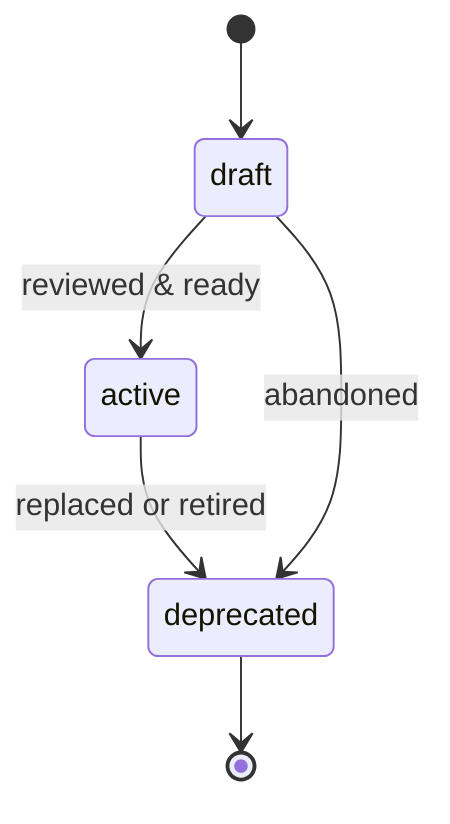

# peer

**peer** is the single, standardized home for AI-related agents, prompts, and
skills. Each skill is a self-contained folder that bundles everything it needs
(supporting prompts, agents, references, scripts) so it can be copied verbatim
into any consumer repo without external dependencies.

## Purpose

- **Centralize** AI artifacts that would otherwise be scattered.
- **Standardize** their structure so any document is predictable to read and edit.
- **Keep skills standalone** — a skill folder is a self-contained unit; pull it
  into a consumer repo and every link still resolves.

## Repository structure

Skills are the primary payload: each skill is a folder `skills/<name>/SKILL.md`
that may bundle `agents/`, `prompts/`, `references/`, `scripts/`, and `assets/`
subfolders. Reusable workflows ship under `.github/workflows/`. A small set of
shared references that haven't yet been folded into a specific skill lives
under `references/engineering/`.

| Path                       | Holds                                                            |
| -------------------------- | --------------------------------------------------------------- |
| `skills/<name>/`           | Skills (SKILL.md format) + optional bundled `agents/ prompts/ references/ scripts/ assets/`. |
| `templates/`               | Document templates, including the canonical base template.      |
| `references/engineering/`  | Shared engineering references (tech stack, code style) — being folded into skills as a follow-up. |
| `.github/workflows/`       | Reusable workflows (`sync-skills`, `lint-skills`) and their consumer guide. |
| `.github/scripts/`         | CI helper scripts (e.g. `lint-skill.py`).                       |
| `INDEX.md`                 | Hand-maintained catalog of every artifact.                      |
| `CONTRIBUTING.md`          | How to add documents and follow the git workflow.               |
| `CHANGELOG.md`             | Repo-level history; each surviving category also has its own.   |

```mermaid
flowchart TD
    root["repo root"]
    root --> readme["README.md"]
    root --> index["INDEX.md"]
    root --> contributing["CONTRIBUTING.md"]
    root --> changelog["CHANGELOG.md"]
    root --> github[".github/"]
    root --> templates["templates/"]
    root --> skills["skills/"]
    skills --> scl["CHANGELOG.md"]
    skills --> sc["skill-creator/SKILL.md"]
    skills --> sgf["gitflow/"]
    sgf --> sgfskill["SKILL.md"]
    sgf --> sgfagents["agents/"]
    sgf --> sgfprompts["prompts/"]
    sgf --> sgfrefs["references/"]
    skills --> sprd["prd/SKILL.md"]
    skills --> sralph["ralph/"]
    sralph --> sralphskill["SKILL.md"]
    sralph --> sralphsh["ralph.sh"]
    skills --> spi["peer-intake/"]
    spi --> spiskill["SKILL.md"]
    spi --> spirefs["references/"]
    root --> references["references/"]
    references --> rcl["CHANGELOG.md"]
    references --> reng["engineering/"]
    reng --> rengdocs["tech-stack-*.md · code-style.md"]
    github --> pr["pull_request_template.md"]
    github --> owners["CODEOWNERS"]
    github --> ghwf["workflows/"]
    ghwf --> ghsync["sync-skills.yml"]
    ghwf --> ghlint["lint-skills.yml"]
    ghwf --> ghsyncdoc["sync-skills-action.md"]
    github --> ghscripts["scripts/"]
    ghscripts --> ghlintpy["lint-skill.py"]
    templates --> base["base-document.md"]
    templates --> tcl["CHANGELOG.md"]
```

## Document standard

Every **non-skill** document (the base template plus any reference under
`references/engineering/`) **must**:

1. Be a copy of [`templates/base-document.md`](templates/base-document.md).
2. Start with **YAML frontmatter** carrying the metadata below.
3. Have a SemVer `version` field.
4. Record its changes in its directory's `CHANGELOG.md` (not a per-document section).

> **Skills are the exception.** Skills follow the **SKILL.md format** instead — a folder
> `skills/<name>/SKILL.md` with `name` + `description` frontmatter (no `version`/`status`/
> `owner`), an imperative body, and optional bundled `agents/ prompts/ references/
> scripts/ assets/`. Create them with the
> [`skill-creator`](skills/skill-creator/SKILL.md) skill, not the base template. They
> are listed in `INDEX.md` and logged in `skills/CHANGELOG.md` (by date, since they have
> no version). The metadata reference below does **not** apply to skills.
>
> **Scripts bundled inside a skill** (e.g. `skills/ralph/ralph.sh`) are executables, not
> Markdown documents. Each carries a header comment with `id` (filename stem),
> `description`, `version` (SemVer), and `owner` — no YAML frontmatter and no separate
> catalog entry.

### Metadata reference

| Field          | Required | Meaning                                                              |
| -------------- | -------- | ------------------------------------------------------------------- |
| `title`        | yes      | Human-readable title.                                               |
| `id`           | yes      | Stable kebab-case identifier; matches the filename stem.            |
| `type`         | yes      | One of `prompt`, `agent`, `template`, `reference`.                  |
| `version`      | yes      | SemVer `MAJOR.MINOR.PATCH`; matches the top changelog entry.        |
| `status`       | yes      | `draft`, `active`, or `deprecated`.                                 |
| `owner`        | yes      | Person or handle responsible for the document.                     |
| `created`      | yes      | ISO date `YYYY-MM-DD` the document was created.                    |
| `updated`      | yes      | ISO date `YYYY-MM-DD` of the last meaningful change.               |
| `tags`         | yes      | List of kebab-case tags for discovery.                             |
| `description`  | yes      | One-line summary; reused verbatim in `INDEX.md`.                   |
| `deprecated_on`| if deprecated | ISO date the document was deprecated.                         |
| `replaced_by`  | if deprecated | `id` of the document that supersedes this one.                |
| `related`      | optional | List of related document `id`s.                                   |

## Versioning

Documents use [Semantic Versioning](https://semver.org/): `MAJOR.MINOR.PATCH`.

- **MAJOR** — a breaking change to the document's behavior, interface, or meaning.
- **MINOR** — an additive, backward-compatible change.
- **PATCH** — wording, typo, or clarification; no behavior change.

When you change a document: bump `version`, update `updated`, and add an entry to
the directory's `CHANGELOG.md` (see [Changelogs](#changelogs)).

## Changelogs

Documents do **not** carry a per-document changelog section. Instead, each top-level
directory keeps one `CHANGELOG.md` (plus a repo-level `CHANGELOG.md` at the root for
`README.md`, `INDEX.md`, and structural changes). This avoids duplicating history
inside every file.

Each `CHANGELOG.md` follows the [Keep a Changelog](https://keepachangelog.com/) style
— entries grouped **by document `id`**, newest version first, using the categories
**Added**, **Changed**, **Deprecated**, **Removed**, **Fixed**, **Security**. Keep the
top version entry in sync with the document's `version` metadata.

## Status lifecycle

A `deprecated` document keeps `deprecated_on` and (when applicable) `replaced_by`
in its metadata so readers know where to go next.

## Adding a new document

> **Creating a skill?** Skills don't use these steps or the base template. Use the
> [`skill-creator`](skills/skill-creator/SKILL.md) skill — it produces a
> `skills/<name>/SKILL.md` in the SKILL.md format. Then add it to `INDEX.md` and
> `skills/CHANGELOG.md`.

For a non-skill engineering reference:

1. Copy [`templates/base-document.md`](templates/base-document.md) into the right
   `references/<topic>/` folder (create the topic subfolder if it doesn't exist).
2. Rename it to `<id>.md` (kebab-case, matching the `id` field).
3. Fill in all required metadata.
4. Write the body; remove optional sections you don't need.
5. Add an initial entry for it in the directory's `CHANGELOG.md`.
6. Register the document in [`INDEX.md`](INDEX.md) under its category.

## Conventions

- **GitHub-flavored Markdown** throughout (tables, fenced code, task lists).
- **All diagrams in [Mermaid](https://mermaid.js.org/)** so they render on GitHub.
- `id` and filenames are **kebab-case**; the `id` matches the filename stem.
- Dates are ISO `YYYY-MM-DD`.
- Changes are logged in each directory's `CHANGELOG.md`, newest version first — not in a per-document section.
