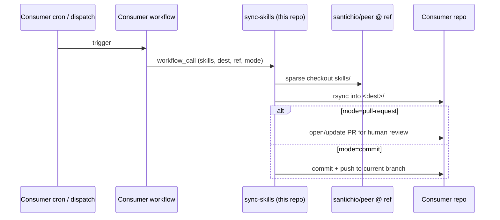
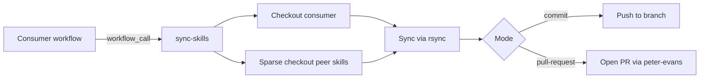

# Sync Skills Action — Consumer Guide

> Consumer guide for the reusable `sync-skills` GitHub Action — inputs, examples, pinning, and troubleshooting.

## Purpose

This document is for **consumer repositories** that want to pull AI skills from
`santichio/peer` into their own `.claude/skills/` (or any) directory. The
[`sync-skills`](../../.github/workflows/sync-skills.yml) reusable workflow does the
fetching, copying, and either commits the changes or opens a pull request.

Use it whenever you want a consumer repo to track skills published from `peer` without
hand-copying files. Skills land in your repo as plain files — no runtime dependency on
this repo at execution time.

## How the sync works

The model is **pull-based**: this repo never pushes into a consumer. The consumer
declares a workflow in **its own** `.github/workflows/` that calls `sync-skills` and
decides **when** it runs (schedule, manual dispatch, or both). A run does five things:

1. Validates inputs (`mode`, `dest`).
2. Checks out the consumer repo so changes can be written into it.
3. Sparse-checks out `santichio/peer` at the chosen `ref` — only the `skills/` tree.
4. `rsync`s each selected skill into `<dest>/<name>/`. With `delete-stale: true`
   (default), renames and removals in `peer` propagate to the consumer.
5. Applies the change in the consumer per `mode` — opens/updates a PR
   (`pull-request`, default) or commits straight to the current branch (`commit`).

### When does a consumer see a change?

Only when **its own** scheduled run fires (or someone clicks "Run workflow"). Until
then, the consumer's `<dest>/` is whatever the last sync wrote. Pick the cadence in
the consumer workflow — weekly cron is the canonical example, daily/hourly/manual-only
are all valid.

### What does "latest" mean?

The `ref` input decides. It controls **which commit of `peer`** the sync reads from:

| `ref`                | Resolves to                                     | Trade-off                                  |
| -------------------- | ----------------------------------------------- | ------------------------------------------ |
| _empty_ (default)    | `peer`'s default branch tip at run time         | Bleeding edge — moves without warning.     |
| `v1.2.0` (tag)       | That tag's commit                               | Frozen until the consumer bumps the pin.   |
| `<full-sha>`         | That exact commit                               | Same guarantees as a tag, no naming.       |
| `develop` / branch   | The branch tip at run time                      | Tracks a moving branch.                    |

See [Pinning strategy](#pinning-strategy) below for which to use when.



## Inputs

All inputs are optional.

| Input          | Type    | Default               | Description                                                                  |
| -------------- | ------- | --------------------- | ---------------------------------------------------------------------------- |
| `skills`       | string  | `all`                 | CSV of skill folder names to sync (e.g. `gitflow,prd,ralph`) or the literal `all`. |
| `dest`         | string  | `.claude/skills`      | Destination directory inside the consumer repo. Must be a relative path.     |
| `ref`          | string  | _default branch_      | Ref of `santichio/peer` to sync from — a tag, branch, or sha.                |
| `mode`         | string  | `pull-request`        | `pull-request` opens a PR in the consumer repo; `commit` pushes to the current branch. |
| `branch`       | string  | `chore/sync-skills`   | Branch name used in `pull-request` mode.                                     |
| `delete-stale` | boolean | `true`                | Pass `--delete` to `rsync` per skill so renames/removals propagate.          |

## Permissions

The reusable workflow requires:

```yaml
permissions:
  contents: write
  pull-requests: write
```

Set these on the calling job. `pull-requests: write` is only used in `pull-request` mode
but is harmless when `mode: commit`.

## Consumer examples

### Scheduled sync (weekly, Monday 06:00 UTC) — opens a PR

```yaml
# .github/workflows/sync-skills.yml
name: Sync skills from peer
on:
  schedule:
    - cron: "0 6 * * 1"
  workflow_dispatch:
jobs:
  sync:
    uses: santichio/peer/.github/workflows/sync-skills.yml@v1
    with:
      skills: gitflow,prd,ralph
      mode: pull-request
    permissions:
      contents: write
      pull-requests: write
```

### On-demand sync to a custom directory — commits directly

```yaml
on:
  workflow_dispatch:
    inputs:
      ref:
        description: "peer ref to sync from"
        default: ""
jobs:
  sync:
    uses: santichio/peer/.github/workflows/sync-skills.yml@v1
    with:
      skills: all
      dest: .github/claude-skills
      mode: commit
      ref: ${{ github.event.inputs.ref }}
    permissions:
      contents: write
```

## Pinning strategy

| Pin form          | Stability | When to use                                                         |
| ----------------- | --------- | ------------------------------------------------------------------- |
| `@v1`             | High      | Once a release is tagged in `peer` — preferred for production.      |
| `@<full-sha>`     | High      | Pin to an exact reviewed commit; immune to upstream changes.        |
| `@develop`        | Low       | Track the bleeding edge for testing. Don't use for production.      |
| `@feature/...`    | Lowest    | Local testing only.                                                 |

Until a tagged release exists in `peer`, pin to a sha or `@develop`. See
[`git-versioning-releases`](../git/git-versioning-releases.md) for the tagging policy.

## Mode comparison

| Mode            | What happens                                                                                                | Best when                                                              |
| --------------- | ----------------------------------------------------------------------------------------------------------- | ---------------------------------------------------------------------- |
| `pull-request`  | Workflow opens a PR in the consumer repo containing the diff. A human reviews and merges.                   | Default. Aligns with the no-self-merge policy.                         |
| `commit`        | Workflow commits to the current branch and pushes directly. No review gate.                                 | Trusted setups, ephemeral environments, or where review is unwanted.   |

## Troubleshooting

- **No diff in the PR / nothing committed** — the destination is already in sync. Confirm
  by checking the workflow log for `Synced N skill(s):`.
- **Skill folder name not found** — `skills:` input must match the **folder name** in
  `peer/skills/<name>/`, exactly. Run a one-off `workflow_dispatch` with `skills: all` to
  see what's available.
- **`dest` is `.claude/skills/` but it's gitignored in my repo** — `git add` won't pick
  up the files. Either remove the ignore line, change `dest`, or use the `commit` mode
  with `git add -f` (not built into this workflow).
- **PR fails to open with "no permission"** — set `permissions: { contents: write,
  pull-requests: write }` on the calling job, and in repo settings enable
  "Allow GitHub Actions to create and approve pull requests".
- **No tags exist in `peer` yet** — pin to a sha or `@develop` until v1 is tagged.

## Diagrams



## Related

- [`git-branching-strategy`](../git/git-branching-strategy.md) — branch model the
  generated PR follows.
- [`git-commit-conventions`](../git/git-commit-conventions.md) — commit message format
  used by `sync-skills`.
- [`git-versioning-releases`](../git/git-versioning-releases.md) — tagging policy for
  the `@v1` pin form.
