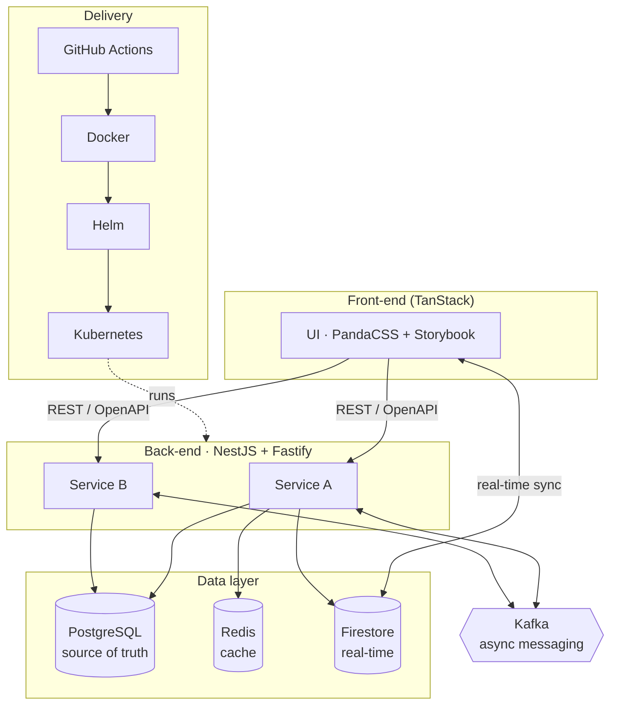

# Tech Stack Overview

> The standard technology stack: how it was chosen, the cross-cutting rules every
> service follows, and how the pieces fit together.

## Purpose

Read this first when starting or evaluating a service. It defines the selection
criteria, the standards that apply to **all** stacks, and the overall architecture.
Layer-specific choices live in the linked front-end, back-end, database, and DevOps
documents.

## Content

### Selection criteria

Technologies are selected against five criteria:

| Criterion | What it means |
| --- | --- |
| Low complexity | Strong market acceptance to ease hiring and training. |
| Market relevance | Among the most globally used (per Stack Overflow Survey, GitHub Octoverse). |
| Stability | Stable versions with long-term support (LTS). |
| Best practices | Alignment with the market's best development practices. |
| Cost-benefit | Good balance of implementation cost and ease of development over raw low-level performance. |

### White-label by design

The application is a **white-label solution** with variable configuration services,
able to adapt to the specific definitions of each instantiating company.

### Cross-cutting standards

These apply to every stack, regardless of layer:

- **Language/runtime:** Node.js with TypeScript across all services.
- **Code quality:** ESLint and Prettier are **mandatory** — see [`code-style`](code-style.md).
- **Packaging & deploy:** Docker images and Kubernetes config managed with Helm.
- **CI/CD:** GitHub Actions.
- **Package manager:** NPM.

### Layers

- [Front-end](tech-stack-frontend.md) — TanStack, PandaCSS + PostCSS, Storybook.
- [Back-end](tech-stack-backend.md) — NestJS + Fastify, Kafka, Jest, Prisma.
- [Database](tech-stack-database.md) — PostgreSQL, Firestore, Redis, Mermaid docs.
- [DevOps](tech-stack-devops.md) — GitHub, Actions, NPM, Docker, Kubernetes, Helm.

## Diagrams

## Glossary

| Term | Description |
| --- | --- |
| Helm | The package manager for Kubernetes; defines, installs, and upgrades apps using "Charts" (packages of pre-configured Kubernetes resources). |
| Docker | Packages software into standardized units called containers, ensuring consistency across development and production. |
| Kubernetes (K8s) | Orchestration system automating deployment, scaling, and management of containerized applications. |
| GitHub Actions | CI/CD platform that automates build, test, and deployment pipelines within GitHub. |
| Node.js | Runtime environment that executes JavaScript/TypeScript outside a web browser. |
| TypeScript | A superset of JavaScript adding static typing to catch errors during development. |
| ESLint | Static analysis tool identifying code patterns to ensure consistency and prevent bugs. |
| Prettier | Opinionated code formatter enforcing a consistent style across the codebase. |
| TanStack | Collection of high-quality libraries (Query, Router, Table, …) for type-safe web apps and state management. |
| PandaCSS | CSS-in-JS library that generates static CSS at build time for high performance. |
| PostCSS | Tool for transforming CSS with JavaScript; optimizes and ensures compatibility of generated styles. |
| Storybook | Tool for building UI components in isolation; essential for documenting the design system. |
| NestJS | Framework for efficient, scalable Node.js server-side apps, heavily inspired by Angular. |
| Fastify | Web framework focused on great developer experience with the least overhead. |
| OpenAPI | Specification defining a standard, language-agnostic interface to RESTful APIs (formerly Swagger). |
| Kafka | Distributed event-streaming platform for high-performance data pipelines and streaming analytics. |
| Jest | JavaScript testing framework focused on simplicity, supporting large web applications. |
| Prisma ORM | Next-generation ORM with a type-safe database client and migration tool. |
| PostgreSQL | Advanced, enterprise-class open-source relational database system. |
| Firestore (Firebase) | Flexible, scalable NoSQL cloud database from Google for syncing data client- and server-side. |
| Redis | In-memory data store used as a database, cache, and message broker for high-speed access. |
| Mermaid | JavaScript diagramming tool that renders Markdown-inspired text into diagrams. |

## Related

- [`code-style`](code-style.md) — the mandatory ESLint + Prettier configuration.
- Layer docs: [front-end](tech-stack-frontend.md), [back-end](tech-stack-backend.md), [database](tech-stack-database.md), [DevOps](tech-stack-devops.md).
