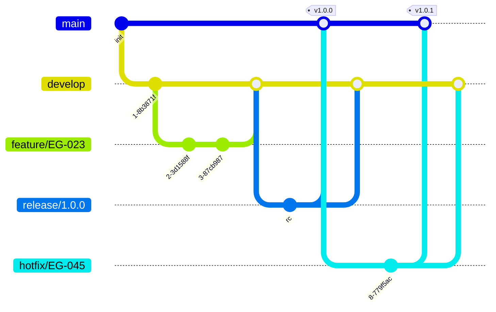

# Git Branching Strategy

> The Gitflow branching model all repositories must implement: branch types, naming, and the merge workflow.

## Purpose

Use this when **creating branches** or **merging**. It defines which branches are
permanent, which are temporary, where each is forked from, and where it merges back.

## Content

### Branch categories

- **Default branches** — protected, permanent, integrated with automations/triggers. Restricted merge permissions; only senior developers approve pull requests. Created at repository creation and never deleted.
- **Support branches** — temporary, created/deleted by any developer with access. Each is owned by a single responsible person and must follow naming patterns.

### Default branches

| Branch | Holds |
| --- | --- |
| `main` | Official release history; reflects production. Always deployable. |
| `develop` | Integration branch for features under active development. |

### Support branches

Every support branch must: fork from a default branch, merge back into a default
branch when complete, be deleted after merge, have a single owner, and follow the
naming format `<issue_id>-<branch_name>` (except release branches).

| Type | Naming | Origin | Merge to |
| --- | --- | --- | --- |
| Release | `release/<version>` — e.g. `release/1.0.0` | `develop` | `main` and `develop` |
| Feature | `feature/<issue_id>-<branch_name>` — e.g. `feature/EG-023-new-page-development` | `develop` | `develop` |
| Hotfix | `hotfix/<issue_id>-<branch_name>` — e.g. `hotfix/EG-045-fix-endpoint-schema-validation` | `main` | `main` and `develop` |

### Workflow

1. Create a `feature/*` branch from `develop`.
2. When complete, merge it back into `develop` via pull request.
3. When `develop` has enough features, cut a `release/*` branch.
4. After testing/refinement, merge the release into both `main` and `develop`.
5. For production issues, create a `hotfix/*` branch from `main`.
6. When the hotfix is done, merge it into both `main` and `develop`.

## Diagrams

## Related

- [`git-versioning-releases`](git-versioning-releases.md) — how releases and tags are cut from these branches.
- [`git-code-review`](git-code-review.md) — pull-request requirements for merging into protected branches.
