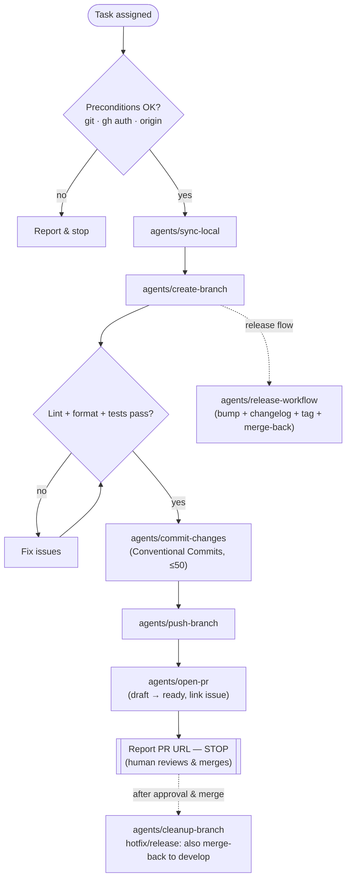

# Gitflow Workflow

Take a change from a fresh branch to an open pull request, following the organization's
gitflow and commit conventions.

**You never merge your own PR.** Per
[`git-code-review`](https://github.com/santichio/peer/blob/main/references/git/git-code-review.md), a change needs at least one
approval and self-merge is not permitted. End at "PR ready for review"; a human approves
and merges. This matters because review is the quality gate the whole policy is built on —
skipping it defeats the point.

Each stage below dispatches to a bundled agent under [`agents/`](agents/). Read the agent
referenced by the current stage before running its commands — do not re-derive the steps
from memory.

## Preconditions

Verify before starting:

- `git --version` and `gh --version` succeed.
- `gh auth status` shows an authenticated account.
- A remote named `origin` exists (`git remote get-url origin`).
- You are **not** about to commit on a protected branch (`main`, `develop`).
- The working tree state is understood (`git status`); stash unrelated changes if needed.

The full pre-flight (with the protected-branch refusal and fast-forward of the base) lives
in [`agents/sync-local.md`](agents/sync-local.md).

## Choose the flow

| Flow | Branch | Origin (fork from) | PR base | Merge-back | Tag |
| --- | --- | --- | --- | --- | --- |
| Feature | `feature/<issue_id>-<name>` | `develop` | `develop` | — | — |
| Hotfix | `hotfix/<issue_id>-<name>` | `main` | `main` | also into `develop` | `v<version>` on `main` |
| Release | `release/<version>` | `develop` | `main` | also into `develop` | `v<version>` on `main` |

Branch names follow [`branch-name-helper`](https://github.com/santichio/peer/blob/main/prompts/git/branch-name-helper.md).
For **release**, use the dedicated [`agents/release-workflow.md`](agents/release-workflow.md)
instead of running the stages below by hand — it owns the version bump, the changelog
update, and the tag.

## Stages

| # | Stage | Agent |
| - | --- | --- |
| 0 | Sync local repo (fetch + fast-forward base, verify clean tree) | [`agents/sync-local.md`](agents/sync-local.md) |
| 1 | Create the support branch from the correct base | [`agents/create-branch.md`](agents/create-branch.md) |
| 2 | Run quality gates and commit atomic Conventional Commits | [`agents/commit-changes.md`](agents/commit-changes.md) |
| 3 | Push the branch with upstream tracking | [`agents/push-branch.md`](agents/push-branch.md) |
| 4 | Open the PR (draft → ready), link the issue, **stop for review** | [`agents/open-pr.md`](agents/open-pr.md) |
| 5 | After merge: cleanup, delete branch, merge-back (hotfix/release) | [`agents/cleanup-branch.md`](agents/cleanup-branch.md) |

For releases, [`agents/release-workflow.md`](agents/release-workflow.md) chains all six
plus the version bump, changelog, tag, and merge-back PR.

## Stop for review

After Stage 4 the PR is ready and CI is running. **Report the PR URL and STOP.** Do not
approve or merge — that's a human decision per
[`git-code-review`](https://github.com/santichio/peer/blob/main/references/git/git-code-review.md). The merge command is shown
for the reviewer's reference only:

```bash
# performed by a human reviewer, after approval — shown for reference only
gh pr merge --no-ff --delete-branch
```

The [`pr-review-assistant`](https://github.com/santichio/peer/blob/main/agents/git/pr-review-assistant.md) agent can produce a
first-pass review before a human takes over; it never approves.

## Guardrails

- Never commit directly to `main` or `develop`; always work on a support branch.
- Never force-push a shared branch.
- If the base advanced, integrate it before requesting review:
  `git fetch origin && git rebase origin/develop` (or merge) and resolve conflicts.
- Keep each commit and each PR to a single logical change.
- Do not merge your own PR — end at "ready for review".
- Hotfix and release always require a second PR `main → develop` after merge — never skip
  the merge-back.

## Lifecycle



## Related references

- [`git-branching-strategy`](https://github.com/santichio/peer/blob/main/references/git/git-branching-strategy.md) — branches, origins, and merge targets.
- [`git-commit-conventions`](https://github.com/santichio/peer/blob/main/references/git/git-commit-conventions.md) — commit message rules.
- [`git-code-review`](https://github.com/santichio/peer/blob/main/references/git/git-code-review.md) — PR and review requirements (no self-merge).
- [`git-versioning-releases`](https://github.com/santichio/peer/blob/main/references/git/git-versioning-releases.md) — tags, releases, merge-back.
