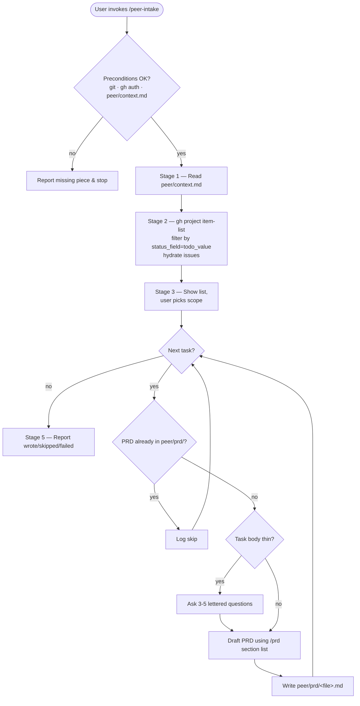

# Peer Backlog Intake

Turn a GitHub Project backlog into a folder of standardized PRDs. One PRD per
"To Do" task, written to `peer/prd/`, in the same section format the
[`prd`](https://github.com/santichio/peer/blob/main/skills/prd/SKILL.md) skill
produces — so every downstream tool (notably
[`ralph`](https://github.com/santichio/peer/blob/main/skills/ralph/SKILL.md))
can consume the result without reshaping.

**You never implement the work.** This skill only writes PRDs. Implementation
starts later, from a PRD, via whatever flow the user chooses (often `ralph`).
Stop after every selected task has either a written PRD or a recorded skip
reason; report a summary and end.

Each stage below is a self-contained block in this document. Run them in order;
do not re-derive steps from memory.

## Preconditions

Verify before starting. If any check fails, report it and stop — do not improvise.

- `git --version` and `gh --version` succeed.
- `gh auth status` shows an authenticated account with read access to GitHub Projects.
- `peer/context.md` exists at the repo root and parses (see
  [`references/context-schema.md`](references/context-schema.md) for the schema).
  If the file is missing, offer to scaffold one from the template in that reference
  and stop until the user has filled in the project coordinates.
- `peer/prd/` exists. If it does not, create it (`mkdir -p peer/prd`) — this is the
  one filesystem side-effect allowed before the user has confirmed anything.

## Stages

| # | Stage | What it does |
| - | --- | --- |
| 1 | Read context | Parse `peer/context.md` frontmatter (project coordinates) and body (product notes). |
| 2 | Fetch To Do tasks | Query the configured GitHub Project, filter by status, hydrate linked issues. |
| 3 | Pick scope | Show the list, let the user confirm or pick a subset. |
| 4 | For each task | Skip if a PRD already exists; otherwise clarify-if-thin → draft → write. |
| 5 | Report | Summarize what was written, skipped, and any tasks that failed to fetch. |

### Stage 1 — Read context

Parse `peer/context.md`. The YAML frontmatter carries the project coordinates
(`github.owner`, `github.project_number`, `github.status_field`,
`github.todo_value`, optional `github.repo`) and PRD output settings
(`prd.output_dir`, `prd.filename_pattern`). The body is free-form Markdown
describing the product, primary users, and any conventions to bias the PRD
generation — keep it loaded for Stage 4 as the **product context** prefix.

If a required field is missing, report exactly which one and point at
[`references/context-schema.md`](references/context-schema.md). Do not guess
values — a wrong owner or project number is a silent way to write PRDs against
the wrong backlog.

### Stage 2 — Fetch To Do tasks

Run the list query:

```bash
gh project item-list <project_number> --owner <owner> --format json --limit 200
```

The JSON returns an `items` array. Each item is one row on the project board.
The status field appears as a top-level key matching its display name (e.g.
`"status": "To Do"`). Filter to items where the configured `status_field`
equals the configured `todo_value`.

For each selected item, hydrate the linked issue:

```bash
gh issue view <number> --repo <owner>/<repo> --json number,title,body,labels,assignees,url,state
```

Draft items (items created directly on the project with no linked issue) come
back with `content.type == "DraftIssue"`; use their title and body as-is. Do
not try to convert drafts into issues — that is a write action and is out of
scope.

If an issue fetch fails (deleted, moved repo, permission), record it for the
final report and continue with the next item — one bad row should not stop the
batch.

### Stage 3 — Pick scope

Show the user the filtered list:

```
Found N tasks with status "To Do":
  1. #42 — Add priority field to tasks               [labels: enhancement]
  2. #51 — Email digest of overdue items             [labels: feature]
  3. (draft) Investigate auth provider migration     [no issue yet]
  ...
```

Then ask whether to process all of them or a subset. Default to processing all
when the user gives a one-word confirmation; accept comma-separated indices
("1, 3") for partial runs. Tasks whose PRD already exists in `peer/prd/` are
shown with an `[existing]` marker — they will be skipped in Stage 4 unless the
user explicitly asks to overwrite (in which case overwrite only the ones they
named, not all).

### Stage 4 — Per-task PRD

For each selected task, in order:

1. **Compute the target path** from `prd.filename_pattern`. Defaults:
   - Issue-backed task → `peer/prd/<issue_number>-<slug>.md` (e.g.
     `peer/prd/42-priority-field.md`).
   - Draft task → `peer/prd/draft-<short_id>-<slug>.md` where `short_id`
     is the first 7 chars of the project item id.
   - `<slug>` is the task title, lowercased, non-alphanumerics replaced with
     `-`, collapsed and trimmed.

2. **Skip if it already exists** (and was not explicitly nominated for
   overwrite). Log one line: `skip: peer/prd/42-priority-field.md (already exists)`.

3. **Decide whether to clarify.** A task is "thin" if any of these hold:
   - Body is empty or under ~3 sentences.
   - No acceptance criteria, success signal, or clear scope are stated.
   - Goal is implied by the title only.

   When thin, ask **3–5 clarifying questions** using lettered options, exactly in
   the format the
   [`prd`](https://github.com/santichio/peer/blob/main/skills/prd/SKILL.md) skill
   prescribes (Problem/Goal, Core Functionality, Scope/Boundaries, Success
   Criteria). Wait for the user's reply. If the task is rich enough, skip the
   questions and go straight to drafting.

4. **Draft the PRD** using the section list from `/prd` (do not invent your
   own). Prepend the file with a provenance header so re-runs and downstream
   tools can trace where the PRD came from:

   ```markdown
   ---
   source:
     issue_url: https://github.com/<owner>/<repo>/issues/<n>   # omit for drafts
     project_item_id: PVTI_...
     project_number: <n>
   generated_at: <YYYY-MM-DD>
   generator: peer-intake
   ---

   # PRD: <Title>

   ## Introduction
   ...
   ## Goals
   ...
   ## User Stories
   ### US-001: ...
   **Description:** As a ..., I want ... so that ...
   **Acceptance Criteria:**
   - [ ] ...
   ## Functional Requirements
   - FR-1: ...
   ## Non-Goals
   ## Design Considerations
   ## Technical Considerations
   ## Success Metrics
   ## Open Questions
   ```

   When drafting, weave in:
   - The **product context** body from `peer/context.md` (audience, tone, stack).
   - The **issue body** and any acceptance criteria already present in it.
   - The **clarifying answers** from step 3, if any were collected.
   - Any **labels** that imply scope or layer (e.g. `backend`, `ux`) — surface
     them in *Technical Considerations* or *Design Considerations* as relevant.

   Follow the writing rules from
   [`prd`](https://github.com/santichio/peer/blob/main/skills/prd/SKILL.md) — small
   user stories, verifiable acceptance criteria, numbered functional requirements,
   explicit non-goals. For any UI story, include
   "Verify in browser using dev-browser skill" as an acceptance criterion.

5. **Write the file.** Use `Write`; do not `Edit` an existing file (Stage 4.2
   already enforced the skip-or-overwrite decision). Log one line:
   `wrote: peer/prd/42-priority-field.md`.

### Stage 5 — Report

After the loop, print a short summary:

```
peer-intake complete:
  wrote   N PRDs
  skipped M existing
  failed  K tasks (issue fetch error or unparseable item)
```

List the failures with one-line reasons. Do not delete or modify anything in
`peer/prd/` from previous runs.

## Guardrails

- **Never modify the GitHub Project.** All `gh` calls in this skill are
  read-only (`project item-list`, `issue view`). No `project item-edit`,
  no `issue edit`, no status changes.
- **Never overwrite an existing PRD without the user naming it explicitly.**
  Re-runs are common; preserving prior drafts (and the human edits on top of
  them) is the whole point of the skip behavior.
- **Never invent project coordinates.** If `peer/context.md` is missing or
  incomplete, stop and point at
  [`references/context-schema.md`](references/context-schema.md).
- **Surface fetch failures; don't paper over them.** A 404 on `gh issue view`
  for one row is fine to continue past; silently writing a PRD with no source
  body is not.

## Lifecycle



## Related references

- [`prd`](https://github.com/santichio/peer/blob/main/skills/prd/SKILL.md) — canonical PRD section list and writing rules; this skill reproduces them, not redefines them.
- [`ralph`](https://github.com/santichio/peer/blob/main/skills/ralph/SKILL.md) — converts a PRD to `prd.json` for the autonomous loop; PRDs written here drop straight into it.
- [`gitflow`](https://github.com/santichio/peer/blob/main/skills/gitflow/SKILL.md) — the precondition pattern and "stop and report" discipline this skill borrows.
- [`references/context-schema.md`](references/context-schema.md) — `peer/context.md` field-by-field spec and paste-ready template.
