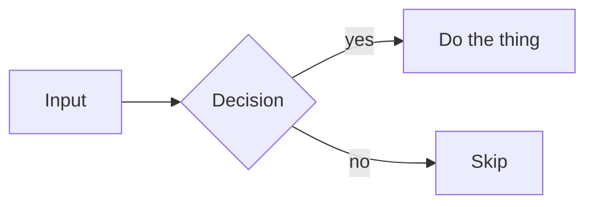

<!--
HOW TO USE THIS TEMPLATE
1. Copy this file into the right category folder (prompts/, agents/, references/).
   NOTE: skills do NOT use this template — they follow the SKILL.md format; use the
   skill-creator skill (skills/skill-creator/SKILL.md) instead.
2. Rename the file to `<id>.md` — kebab-case, matching the `id` in the frontmatter.
3. Fill in every required metadata field above (see README.md for the field reference).
4. Replace the body sections below. Remove any optional section you don't need.
5. Add an entry to INDEX.md under the matching category.
6. Record the change in this directory's CHANGELOG.md (newest entry on top).
-->

# Base Document Template

> One-sentence statement of what this document is. Mirror the `description` metadata.

## Purpose

What this document is for, and **when to use it**. Describe the problem it solves
and the situations where it applies. Keep it short and concrete.

## Content

The actual body — the skill, prompt, agent definition, or reference material.
This is the heart of the document. Structure it however the content demands
(headings, lists, tables, code blocks).

```text
Put prompt text, instructions, or definitions here when relevant.
```

## Usage

_Optional._ How to apply this document in practice: steps, inputs/outputs,
example invocations, or copy-paste snippets.

## Diagrams

_Optional._ Use [Mermaid](https://mermaid.js.org/) for all diagrams so they
render natively on GitHub. Example:



## Related

_Optional._ Link related documents. Keep these in sync with the `related`
metadata field above.

- [`other-doc-id`](../references/other-doc-id.md) — why it's related.

<!--
CHANGELOG: do not add a changelog section here. Record changes to this document
in this directory's CHANGELOG.md, grouped by document id, newest entry first.
Bump the `version` metadata using SemVer (MAJOR.MINOR.PATCH):
  - MAJOR — breaking change to behavior, interface, or meaning.
  - MINOR — additive, backward-compatible change.
  - PATCH — wording, typo, or clarification; no behavior change.
-->
